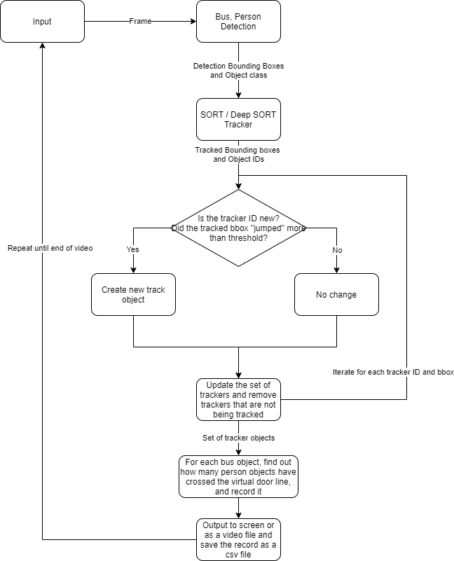

# PeekingDuck_familiarization
## 1. Description

This mini project attempts to test out the Human-Pose Estimation and Object Detection features in [PeekingDuck](https://github.com/aimakerspace/PeekingDuck) library. Two simple use cases are being tested:
1. Dab Detection using pose detection models from PeekingDuck
2. Counting of number of passengers boarded in each bus in a recorded video using object detection from PeekingDuck and [SORT](https://github.com/alexgoft/SORT_OpenCV_Trackers) or [DeepSort](https://github.com/nwojke/deep_sort) tracking library

A small extension has also been added to this library to test out the [ROS2 Galactic](https://docs.ros.org/en/galactic/index.html) integration with PeekingDuck framework. In this extension, a small feature has been added ── _counting of number of people at the bus stop using the same footage as use case 2_. (Refer to Section 5) 

### 1.1 Dab Detection example using HRNet + YOLOv4


### 1.2 Passenger Counting
As the test video for performing the passenger counting cannot be released publicly, an illustration would be used to illustrate the given problem for passenger counting.<br>
<br>
There are several assumptions to this problem:
1. Perspective of the camera remains constant
2. Passengers only boards the bus from the right-side (image's perspective)
3. Boarding only when the bus stops
4. Passengers who boarded the bus do not alight in the same bus stop

## 2. Project Organization
------------
    .
    ├── README.md
    ├── config                    -> Contains yaml config files for various experiments
    │   ├── dab_recoginition      
    │   └── passenger_counting
    ├── dockerfiles               -> Contains docker image for ROS experimentation    
    ├── dab_detection_demo.ipynb  -> Notebook for dab recognition demo
    ├── data                      -> To contain input or output data. Included in gitignore.
    ├── environment.yml
    ├── images                    -> images for README file
    ├── requirements.txt
    ├── runner.py                 -> Python script for running passenger counting
    └── src
        ├── custom_nodes
        │   ├── configs
        │   │   ├── dabble        -> Config files for the respective dabble custom nodes
        │   │   ├── draw          
        │   │   └── output
        │   ├── dabble            -> Contains the source code for the 2 custom nodes
        |   |   ├── deep_sort     -> Files pertaining to the deep sort tracker
        │   |   ├── sort_tracker  
        │   |   └── utils         -> Contains utility files for drawing on image and for tracking
        │   ├── draw              -> Custom draw node
        │   └── output            -> Custom csv writer node
        ├── data                  -> Contains yaml config files for recording videos for dab recognition, and a script to convert video file format from mkv to mp4 format
        └── ros_communication     -> Contains ROS subscribers for publishing nodes.
--------

## 3. Usage
### 3.1 Dab Detection using PeekingDuck CLI
#### 3.1.1 Dab Detection with Live Input
Using __HRNet + YOLOv4__:
```bash
peekingduck run --config_path ./config/dab_live_hrnet_config.yml
```
Using __PoseNet__:
```bash
peekingduck run --config_path ./config/dab_live_posenet_config.yml
```

#### 3.1.2 Dab Detection with Recorded video
Command to run dab detection using __HRNet + YOLOv4__:
```bash
peekingduck run --config_path ./config/dab_recorded_hrnet_config.yml
```
Command to run dab detection using __PoseNet__:
```bash
peekingduck run --config_path ./config/dab_recorded_posenet_config.yml
```
By default, it will look for the video file in the following path ```data/raw/video1.mp4```. It can be changed manually in the respective yaml configuration file as such:
```yaml
nodes:
- input.recorded:
    input_dir: "path_to_your_video_file"
```
The output video will be in ```data/processed/``` by default. Again, it can be changed manually in the respective yaml configuration file as such:
```yaml
nodes:
- output.media_writer:
    output_dir: "path_to_your_video_file"
```

### 3.2 Passenger Counting using recorded video
To test the passenger counting, **a recorded video is required with a similar perspective** as shown in the illustration in **Section 1.2** above.

To run the programme, issue the following command:
```bash
python runner.py
```

```
usage: runner.py [-h] [--config CONFIG]

Passenger Counting Algorithm

optional arguments:
  -h, --help       show this help message and exit
  --config CONFIG  Path to the config file (Default: "./config/passenger_counting/")
```
* General configurations can be changed in the config file: ```config/passenger_counting/runner_config.yaml```

    1. To set or change the input video path
    2. Whether to use multithreading and buffering for the input node (Default is False)
    3. Hyperparameters for the YOLOv4 object detection model
    4. Whether to record the passenger counts to a csv file
    5. Whether to output the processed frames to the screen or save them as a video file
    6. Output path of the video file (Not applicable when output to the screen option is True)

* Specific parameters for tracking are in the config file: ```src/custom_nodes/configs/dabble/person_bus_tracker.yml```. In this config file, the user can change the hyperparameters for the tracking node such as the following:
    1. Whether to use Deep SORT or SORT algorithm
    2. Bus / Person tracking specific parameters such as the number of frames a tracker should stay without being updated and the type of tracker being used.
    3. Whether multithreading is used for tracking the bus and person respectively
    4. Whether to show the class of the bounding box in the tag (Top of the bbox)
    5. Whether to include bboxes from the YOLOv4 detection algorithm (in addition to the default tracker bboxes) and tags (placed at the bottom of bbox) to identify them as the detection bboxes

* Parameters for passenger counting heuristics are in the config file: ```src/custom_nodes/configs/dabble/passenger_counting.yml```. In this config file, the user can change settings such as the following:
    1. Bus tracker object parameters. E.g.: Estimated "door" height, "Door" offset
    2. Both bus and person tracker object parameters. E.g.: The moving average parameters of bounding boxes
    3. The size of the person with respect to the bus bbox to be considered as a boarding passenger
    4. Whether to indicate the passenger counts on the top left of the bus bbox

* Lastly, the parameters for saving the passenger records to CSV file can also be changed in the config file ```src/custom_nodes/configs/output/record_df_to_csv.yml```. The following parameters can be changed:
    1. The writing mode for the CSV file, whether to overwrite or append to an existing file.
    2. The output path of the CSV file. If parent directories do not exist, it will be created. 

Descriptions can also be found in the comments in the yaml file.

## 4. Method
### 4.1 Dab Detection
The Dab Detection process is based on some of the Pose Estimation / Object Detection models (YOLOv4 + HRNet or PoseNet) that comes with the [PeekingDuck](https://github.com/aimakerspace/PeekingDuck) library.

For the full list of models available and their corresponding performances, please refer to the links [Object Detection Models](https://peekingduck.readthedocs.io/en/stable/resources/01a_object_detection.html#general-object-detection-ids) and [Pose Estimation Models](https://peekingduck.readthedocs.io/en/stable/resources/01b_pose_estimation.html#whole-body-keypoint-ids).

By using the Pose Estimation Model and obtaining the respective pose coordinates, a [custom](https://peekingduck.readthedocs.io/en/stable/getting_started/03_custom_nodes.html#) "Dabble" node was created with a set of rules to determine if the detected pose coordinates are indeed from a Dab Move as shown below:
<br>
_Image by <a href="https://pixabay.com/users/mohamed_hassan-5229782/?utm_source=link-attribution&amp;utm_medium=referral&amp;utm_campaign=image&amp;utm_content=5185246">mohamed Hassan</a> from <a href="https://pixabay.com/?utm_source=link-attribution&amp;utm_medium=referral&amp;utm_campaign=image&amp;utm_content=5185246">Pixabay</a>_ <br>

#### 4.1.1 Dab Detection Heuristics
1. One of the arms has to be bent while the other arm has to be straightened
2. The head (nose or left eye, or right eye) has to be close to either the elbow or the wrist of the bent arm.
3. Both lower arms have to be almost parallel

In addition, if any of the keypoints coordinates - wrists AND shoulders AND elbows AND (left eye or right eye or nose) is __missing__ from the pose estimation output, it will __not__ detect any dab action.

#### 4.1.2 Scoring
The scoring of each dab is based on how close the detected poses are to each of the rules above. For checking whether the arms are bent or straight and whether the lower arms are parallel, cosine similarity functions are used.

For checking if the head is close to the wrist or elbow, L2-norm distance is used and it is normalized by the length of the lower arm.

Each of the scores has to be above or below certain predefined threshold to be considered successful. The set of predefined thresholds can be changed in the configuration file ```src\custom_nodes\configs\dabble\dab_recognition.yml``` in the following:
```yaml
thresholds:
  straight_arm: 0.8       # [0, 1] More is better
  bent_arm: 0.4           # [0, 1] More is better
  head_wrist: 0.4         # [0, 1] Less is better. How close the head is to either the wrist or elbow
  lower_arm_parallel: 0.8 # [0, 1] More is better
```
The final score is the weighted sum of the score from the individual rules. The weightage of each score for the respective rules can be changed by the user in the yaml configuration file ```src\custom_nodes\configs\dabble\dab_recognition.yml``` in the following:
```yaml
score_weightage:
  straight_arm: 0.25
  bent_arm: 0.25
  head_wrist: 0.25
  lower_arm_parallel: 0.25
```
The final score is being calculated from the formula: (1 - head_wrist_threshold) $\times$ head_wrist_weightage + $\Sigma$ (remaining_thresholds $\times$ score_weigtage)

It is to note that the lower bound of the score is dependent on the threshold being set _(i.e. lower threshold will result in a reduced lower bound of the score)_.

In addition, the sum of the score weightage do not need to be 1. A function has been included in the process to automatically normalize the total score weightage to 1.

### 4.2 Bus Passenger Counting
An overview of the passenger counting algorithm can be illustrated in the flowchart below:



#### 4.2.1 Challenges
Finding out how many passengers boarded a particular bus can be tricky and it can be sensitive to the **performance of the object detection model** as well as the **tracker's performance**. Some of the problems and challenges are as follows:
1. Occlusion of persons and buses.
    * Object detection model unable to detect person or bus. This leads to under-counting
2. False positives from detection model.
    * Mistaken cars for buses (Can be tuned by increasing the score threshold for the object detection model)
    * Mistaken 2 buses as 1 bus (Can be tuned by reducing IOU threshold)
3. "Ghost" bboxes from tracker
    * Can be due to erroneous detections from object detection model
4. ID switching
    * Can be due to wrong matching result between detection bboxes and predicted bboxes from tracker
5. Bounding boxes "jumping around"
    * Moving average is used to get a smoother motion of the tracked objects

#### 4.2.2 Tracking and Counting Strategies
In view of the above challenges, besides finetuning or obtaining a better model or tracker, a strategy to count the passengers and to manage the person tracker objects has been devised.

Each tracker object is considered to be a new object only if it has not been tracked before. i.e. tracker ID not found in list. Also, for person object, if the previous bbox of a specific ID has an IOU that is below certain threshold, it is considered to be a new object in the subsequent frame. This is to tackle the problem of ID switching. For object IDs that were present in previous frame but absent in current frame, they will be removed from the list and deemed as being left from the view of the camera (This is because there is no object re-ID and ID numbers are being reused by the tracker every time it sees a 'new' object).

For a person to be considered to be boarded a certain bus, there are several requirements:
1. The centroid of the person bbox must first be on the right side of the door (a virtual line offset from the bus), and subsequently appear on the left side.
2. The size of the person bounding box with respect to the bus's bounding box must be within certain threshold. This is to prevent over counting for people walking behind or in front of the bus.
3. The centroid of the person must be within the y values of the "bus door"

#### 4.2.3 CSV Output
A CSV file with the number of passengers boarded for each bus is saved every time the programme ends. The output path can be changed in the config file: ```src/custom_nodes/configs/output/record_df_to_csv.yml``` The output format is as such:

|   | Number of Passengers | Recorded Time |
|---|----------------------|---------------|
| 0 | n                    | min:sec       |

The recorded time is the time when the bus was first captured by the detection model.

## 5. ROS2 Experimentation (Extension)
ROS2 Publisher and Subscriber have been added. The publisher is part of the dabble node in the PeekingDuck framework under ```src\custom_nodes\dabble\bus_stop_count_pub.py``` It publishes the following:
1. Number of person at the predefined zone (bus stop) at any given point in time
2. Video frames with the zone (bus stop) bounding box being drawn.

The subscriber will subscribe to the String message and print out in the command line while the received image will be displayed in a separate window
### 5.1 How to run
1. Either [install](https://docs.ros.org/en/galactic/Installation.html) the ROS Galactic environment to your computer or use a [prebuilt image](https://hub.docker.com/repository/docker/xholyspirit/ros). It is recommended to run the container using a docker-compose file. A demo docker-compose file has been added in ```dockerfiles/docker-compose-demo.yaml```. **Make sure to edit line 9 to bind your local volume to the container's volume**
2. Clone this repo.
3. At the default environment, install Python OpenCV.
```bash
python3 -m pip install opencv-python
```
The ROS subscriber node will need this library and the reason for installing in the default environment is because the ROS subscriber node uses the system interpreter, and not from the virtual environment's. 

4. At the root of this project directory, issue the following command to create a virtual environment.
```bash
virtualenv -p python3 ./venv
source ./venv/bin/activate # Make a virtual env and activate it
touch ./venv/COLCON_IGNORE # Make sure that colcon doesn’t try to build the venv
pip install -r requirements.txt # install the necessary requirements for the peekingduck nodes
```
5. Build the ROS2 packages
```bash
rosdep install -i --from-path src --rosdistro galactic -y
colcon build
. install/setup.bash
```

6. Issue the following command to run the PeekingDuck's nodes
```bash
python runner.py
```

7. Open a separate terminal, and run the ROS2 subscriber node
```bash
ros2 run ros_communication listener
```
Once the subscriber receives information from the publisher, it will show the number of people at the bus stop in the CLI and a footage with the bus stop bounding box will be displayed.

Note: The configurations for the PeekingDuck's publishing node ```bus_stop_count_pub``` can be changed in the yaml file: ```src/custom_nodes/configs/dabble/bus_stop_count_pub.yml```. 

## 6. License
The PeekingDuck library is under the open source [Apache License 2.0](https://github.com/aimakerspace/PeekingDuck/blob/dev/LICENSE) while the DeepSORT library is under the [GPL-3.0 License](https://github.com/nwojke/deep_sort/blob/master/LICENSE) 
## 7. Author and Acknowledgements
**Author**
* [Eric Kwok](https://github.com/eric-kwok-nt)

This mini-project was created using [PeekingDuck](https://github.com/aimakerspace/PeekingDuck), [SORT_OpenCV_Trackers](https://github.com/alexgoft/SORT_OpenCV_Trackers), [DeepSORT](https://github.com/nwojke/deep_sort) tracker libraries and experimented using the [ROS2 Galactic](https://docs.ros.org/en/galactic/index.html) framework.
